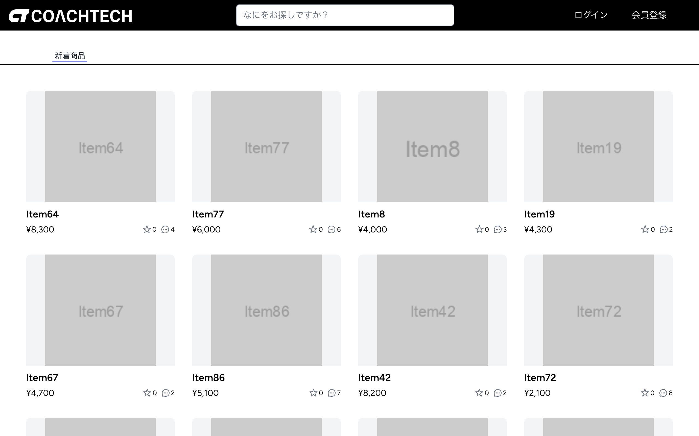

# フリマアプリ

## アプリの概要

このアプリは、プログラミングスクールの課題として作成してフリマアプリです。
機能として検索、出品、購入、コメント、お気に入り登録などが可能です。
バックエンドにLaravel、フロントエンドにVue.js、決済機能にStripeを使用しています。



## アプリケーションURL

- [トップページ](https://web-no-benkyo.com)
- [会員登録ページ](https://web-no-benkyo.com/register)
- [ログインページ](https://web-no-benkyo.com/login)
- [管理者ログインページ](https://web-no-benkyo.com/admin/login)

管理者ログインには以下の認証情報を使用してください。

| 項目           | 値                |
| -------------- | ----------------- |
| メールアドレス | admin@example.com |
| パスワード     | password          |

## 関連URL

- [CircleCIプロジェクト](https://app.circleci.com/pipelines/circleci/kG6BoGeV71NANFRbXtPJm/3f5Mw8GzTRxWBFAcdsnv6V)

## 機能一覧

- 会員認証
  - 会員登録
  - ログイン
  - ログアウト
- 商品情報
  - 商品一覧取得
  - 商品名検索
  - 商品説明検索
  - 商品状態検索
  - 商品カテゴリ検索
  - 商品詳細取得
- 出品
- 購入
- お気に入り
- コメント
- 会員情報
  - 会員情報取得
  - プロフィール編集
- 管理者認証
  - ログイン
  - ログアウト
- 管理
  - 会員削除
  - メール送信

## 使用技術(実行環境)

- PHP 8.2
- Laravel 11.x
- Laravel Breeze 2.x
- Laravel Cashier 15.x
- Vue.js 3.x
- Stripe.js 3.x
- MySQL 8.0.x

## 設計書

- [テーブル設計](documents/table.md)
- [ER図](documents/er-diagram.md)

## ローカル環境構築

このセクションでは、ローカル環境でアプリを実行する手順を説明します。
実行するには Docker と Stripe CLI のインストールが必要です。

1. プロジェクトのリポジトリをクローンしてください。

```shell-session
git clone https://github.com/ryamao/free-market.git
```

2. クローンしたリポジトリのディレクトリに移動します。

```shell-session
cd free-market
```

3. 環境設定ファイルを作成してください。

```shell-session
cp .env.example .env
```

環境設定ファイルの以下の項目に値を設定してください。

| 変数名                | 説明                             |
| --------------------- | -------------------------------- |
| ADMIN_EMAIL           | 管理者アカウントのメールアドレス |
| ADMIN_PASSWORD        | 管理者アカウントのパスワード     |
| VITE_STRIPE_KEY       | Stripeの公開可能キー             |
| STRIPE_KEY            | Stripeの公開可能キー             |
| STRIPE_SECRET         | Stripeのシークレットキー         |
| STRIPE_WEBHOOK_SECRET | Stripe Webhookのシークレットキー |

4. プロジェクトの依存関係をインストールしてください。

```shell-session
docker run --rm \
    -u "$(id -u):$(id -g)" \
    -v "$(pwd):/var/www/html" \
    -w /var/www/html \
    laravelsail/php82-composer:latest \
    composer install --ignore-platform-reqs
```

5. Docker コンテナを起動して、アプリをセットアップしてください。

```shell-session
vendor/bin/sail up -d --build
vendor/bin/sail artisan key:generate
vendor/bin/sail artisan storage:link
vendor/bin/sail artisan migrate --seed
vendor/bin/sail npm ci
```

6. 新しいコンソールを開いて Vite を起動してください。

```shell-session
vendor/bin/sail npm run dev
```

7. Stripe にログインして Webhook イベントをモニタリングしてください。

```shell-session
stripe login
stripe listen --forward-to localhost/stripe/webhook
```

8. ブラウザから http://localhost にアクセスして動作確認してください。
   メール送信の確認は http://localhost:8025 で行ってください。

## テスト手順

このセクションでは、テストの実行手順を説明します。
まず、[ローカル環境構築](#ローカル環境構築)を実施してブラウザからアプリにアクセスできることを確認してください。

1. Vite を終了してください。

2. フロントエンドをビルドしてください。

```shell-session
vendor/bin/sail npm run build
```

3. テスト用の環境設定ファイルを作成し、以下の変数を書き換えてください。

```shell-session
cp .env .env.testing
```

| 変数        | 変更後  |
| ----------- | ------- |
| APP_ENV     | testing |
| DB_DATABASE | testing |
| MAIL_MAILER | log     |

4. E2Eテスト用の環境設定ファイルを作成し、以下の変数を書き換えてください。

```shell-session
cp .env .env.dusk.testing
```

| 変数        | 変更後              |
| ----------- | ------------------- |
| APP_ENV     | testing             |
| APP_URL     | http://laravel.test |
| DB_DATABASE | testing             |
| MAIL_MAILER | log                 |

5. テストを実行してください。

以下のコマンドで機能テストを実行できます。

```shell-session
vendor/bin/sail test
```

以下のコマンドでE2Eテストを実行できます。

```shell-session
vendor/bin/sail dusk --env=testing
```

## デプロイ手順

このセクションでは Terraform を使用して AWS 上に環境を構築する手順を説明します。
実行するには Terraform CLI と AWS CLI のインストールが必要です。

1. `terraform` ディレクトリに移動してください。

```shell-session
cd terraform
```

2. `terraform.tfvars` を以下の内容で作成してください。

```terraform
domain_name           = "アプリのドメイン名"
aws_access_key_id     = "AWSのアクセスキーID"
aws_secret_access_key = "AWSのシークレットアクセスキー"
stripe_key            = "Stripeの公開可能キー"
stripe_secret         = "Stripeのシークレットキー"
stripe_webhook_secret = "Stripe Webhookのシークレットキー"
```

3. AWS にログインしてください。

```shell-session
aws sso login
```

4. Terraform を実行して AWS にリソースを作成してください。

```shell-session
terraform init
terraform apply -auto-approve
```

5. `terraform.tfvars` に設定したドメインからアプリにアクセスしてください。

6. 使い終わったらリソースを削除してください。

```shell-session
terraform destroy -auto-approve
```
